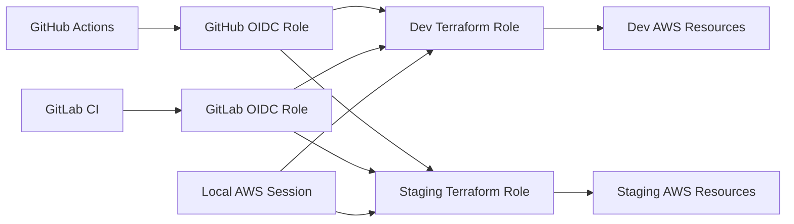

# Terraform AWS EKS Platform Lab

This repository is a production-style Terraform platform for AWS EKS. It models a multi-account AWS setup with reusable modules, remote state in S3, state locking, CI identity federation, and cross-account role assumption.

It is a lab repository, not a claim of production readiness. The code demonstrates production-oriented patterns such as short-lived credentials, environment-specific Terraform execution roles, scoped IAM policy work, and separate bootstrap and environment state.

## Architecture

The repository separates identity/bootstrap concerns from environment infrastructure.



Confirmed account flow:

```text
Management account
-> CI OIDC role
-> environment Terraform execution role
-> dev or staging AWS resources
```

Confirmed local access flow:

```text
Local authenticated AWS session
-> environment Terraform execution role
-> environment AWS resources
```

The management account hosts CI identity integration. Child accounts contain dedicated Terraform execution roles. Environment Terraform providers assume child-account roles. Backend authentication is separate from provider authentication, so both must be configured correctly. Bootstrap state and environment state are separate. The dev environment also uses a management-account provider for a read-only Route53 hosted-zone lookup.

## Repository Structure

```text
.
├── bootstrap/
├── environments/
│   ├── dev/
│   └── staging/
├── modules/
│   ├── acm/
│   ├── ec2/
│   ├── ecr/
│   ├── eks/
│   ├── karpenter/
│   ├── load-balancer-controller/
│   ├── route53/
│   ├── s3/
│   └── vpc/
├── .gitlab-ci.yml
├── .gitignore
├── Makefile
├── README.md
└── CLAUDE.md
```

`bootstrap/` manages foundational IAM, OIDC, cross-account roles, state access, and compatibility resources.

`environments/dev/` contains the dev environment backend, providers, variables, and module composition.

`environments/staging/` contains the staging environment backend, providers, variables, and a smaller module composition.

`modules/` contains reusable Terraform modules. The `modules/acm/` directory exists but currently contains no Terraform files.

`.gitlab-ci.yml` defines the GitLab pipeline. No `.github/workflows/` directory exists in the current repository tree, even though GitHub OIDC bootstrap resources exist.

`Makefile` contains convenience commands, including destructive targets. Treat it as a reference, not a safe quick-start.

## Bootstrap Layer

The bootstrap layer manages identity and state foundations:

- GitLab OIDC provider and GitLab CI role.
- GitHub Actions OIDC provider.
- GitHub Actions roles for dev and staging.
- Child-account Terraform execution roles.
- Trust relationships from CI roles and local identities into environment execution roles.
- State bucket access policies for GitLab compatibility.
- Scoped and legacy IAM policies used during migration.
- Outputs for CI roles, OIDC providers, and environment execution roles.

Bootstrap changes affect authentication, IAM, cross-account access, and remote state foundations. Review bootstrap plans carefully before applying them.

## Environment Layer

Each environment has its own backend and provider configuration.

Dev:

- Uses an S3 backend with a dev state key.
- Backend role assumption is configured in `environments/dev/backend.tf`.
- Provider role assumption is configured in `environments/dev/main.tf`.
- Uses `allowed_account_ids`.
- Composes VPC, EC2, S3, EKS, ECR, Route53, AWS Load Balancer Controller, and Karpenter modules.
- Creates an EKS access entry for Karpenter nodes.

Staging:

- Uses an S3 backend with a staging state key.
- Provider role assumption is configured in `environments/staging/main.tf`.
- Composes VPC, EC2, S3, and EKS modules.
- Staging CI jobs are currently commented out in `.gitlab-ci.yml`.

Backend initialization happens before provider initialization. Backend credentials and provider credentials are separate concerns.

## Modules

`vpc`: Creates VPC networking, public and private subnets, routing, NAT gateway, security groups, VPC flow logs, and related IAM for flow logs.

`ec2`: Creates an EC2 instance, key pair from Secrets Manager, IAM role, instance profile, and SSM managed-policy attachment.

`s3`: Creates application and logging buckets, encryption, versioning, lifecycle configuration, public access blocks, SQS event queue, queue policy, and bucket notification.

`eks`: Creates EKS cluster IAM roles, EKS cluster, managed node group, KMS key for secrets encryption, cluster security group, and IRSA OIDC provider.

`ecr`: Creates ECR repositories and lifecycle policies.

`route53`: Reads an existing public hosted zone.

`load-balancer-controller`: Creates IAM role, IAM policy, and attachment for the AWS Load Balancer Controller.

`karpenter`: Creates Karpenter controller and node IAM, instance profile, interruption SQS queue, EventBridge rules and targets, queue policy, and controller IAM policy.

`acm`: Directory exists but currently has no Terraform implementation.

## IAM and Authentication Model

The repository is moving toward a professional IAM model:

- Short-lived credentials through OIDC rather than static cloud keys.
- CI identity in the management account.
- Cross-account role assumption into child environment accounts.
- Dedicated Terraform execution role per environment.
- Customer-managed policies for scoped Terraform permissions.
- Explicit AWS actions where policies have been hardened.
- Scoped resource ARNs where supported.
- Restricted `iam:PassRole`.
- Separate trust policies and permission policies.
- No permanent AWS credentials in CI code.
- GitLab support preserved during GitHub Actions migration.

Some broad AWS-managed policies remain and are being replaced one service group at a time. Do not remove GitLab support until GitHub Actions is verified end-to-end.

## Current Migration Status

Confirmed from repository code:

- GitHub OIDC bootstrap resources exist.
- GitLab OIDC support remains.
- Dev and staging GitHub OIDC roles exist in bootstrap code.
- Dev uses a dedicated Terraform execution role for backend and provider access.
- Dev IAM permissions are being moved toward scoped customer-managed policies.
- Staging still requires separate review before matching all dev IAM hardening.
- GitHub Actions workflow files are not present in the current tree.
- GitLab CI is present and active for dev.
- Staging jobs in GitLab CI are currently disabled in comments.
- Route53 lookup in dev is read-only through a management-account provider.
- Dev infrastructure may be intentionally destroyed between sessions to reduce cost.

## Prerequisites

- Terraform compatible with the versions declared in code.
- AWS CLI.
- Git.
- An authenticated AWS session with permission to assume the required roles.
- Access to the management account.
- Permission to assume environment Terraform execution roles.
- Backend configuration values for state bucket and lock table.
- Environment variable values or tfvars for required Terraform variables.

The repository also references optional validation tools in CI, including TFLint and Checkov.

## Safe Local Workflow

Start with read-only inspection:

```bash
git status
git diff
terraform fmt -recursive
```

Bootstrap validation and plan:

```bash
terraform -chdir=bootstrap validate
terraform -chdir=bootstrap plan
```

Dev backend initialization:

```bash
terraform -chdir=environments/dev init -reconfigure \
  -backend-config="bucket=<DEV_STATE_BUCKET>" \
  -backend-config="dynamodb_table=<LOCK_TABLE>"
```

Dev validation:

```bash
terraform -chdir=environments/dev validate
```

Dev plan:

```bash
terraform -chdir=environments/dev plan
```

Staging backend initialization:

```bash
terraform -chdir=environments/staging init -reconfigure \
  -backend-config="bucket=<STAGING_STATE_BUCKET>" \
  -backend-config="dynamodb_table=<LOCK_TABLE>"
```

Staging validation:

```bash
terraform -chdir=environments/staging validate
```

Staging plan:

```bash
terraform -chdir=environments/staging plan
```

Do not make `terraform apply` part of the normal quick-start flow.

## Apply Safety

- Always review a plan before apply.
- Prefer saved plan files for reviewed applies.
- Never apply unexpected destroy or replacement actions.
- Stop if backend initialization points to an unexpected state.
- Inspect `terraform state list` when resource count looks wrong.
- Remember that bootstrap and environment state are different.
- Remember that backend initialization happens before provider initialization.
- A large add-only plan may be expected if an environment was intentionally destroyed.
- Dev infrastructure may intentionally be destroyed to reduce cost.
- Do not assume missing resources mean state loss until state and AWS are checked.
- Do not remove GitLab support until GitHub Actions is verified.

## CI/CD

Confirmed GitLab CI behavior:

- GitLab OIDC token is requested per job.
- CI assumes the GitLab OIDC role in the management account.
- Dev backend initialization passes backend configuration values in CI.
- Dev plan creates a saved plan artifact.
- Dev apply consumes the saved plan artifact.
- Staging jobs are present but commented out.
- Validation and test jobs run formatting, Terraform validation, TFLint, and Checkov.

Confirmed GitHub behavior:

- Bootstrap code defines GitHub OIDC provider and environment-specific GitHub roles.
- No GitHub Actions workflow files are present in the current tree.

Plan and apply are separated in GitLab CI. Treat CI variables and secrets as sensitive and keep them out of documentation.

## Cost Management

Dev infrastructure may be intentionally destroyed between test sessions to reduce cost. EKS clusters, NAT gateways, load balancers, and compute resources can create ongoing cost.

A future plan may show many resources to add after an intentional destroy. That is expected only after confirming state location and AWS resource status.

## Troubleshooting

`Backend initialization required`: backend configuration changed or `.terraform` metadata is stale. Reinitialize with the intended backend settings.

`S3 403 on state`: backend credentials may not have access to the state bucket. Check backend role assumption and bucket policy.

`sts:AssumeRole denied`: the caller may not be trusted by the target execution role. Check trust policy separately from permissions policy.

`Missing IAM permission`: identify the failing AWS action and resource, then update the execution-role policy with the smallest confirmed permission.

`Unexpectedly large add-only plan`: confirm the backend key, state bucket, state list, and whether infrastructure was intentionally destroyed.

`Empty or partial terraform state`: verify backend initialization values before assuming state loss.

`Wrong backend key`: check `backend.tf` and any `-backend-config` arguments.

`Provider using wrong account`: check provider role assumption, `allowed_account_ids`, and Terraform variable values.

## Contributing

- Make one focused change at a time.
- Work one environment at a time unless a cross-environment change is intentional.
- Run formatting, validation, and plan commands.
- Explain IAM changes clearly.
- Avoid unrelated refactors.
- Update documentation when architecture or workflow changes.
- Keep GitLab compatibility unless removal is explicitly planned and verified.
